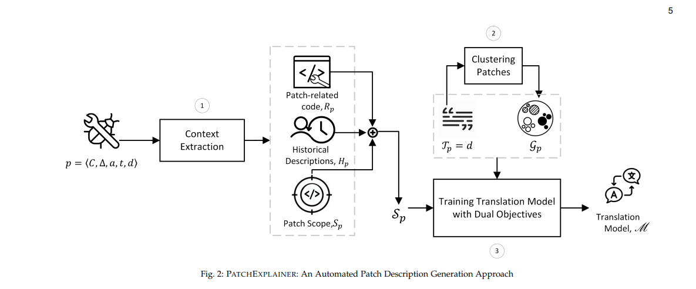

# Automated Description Generation for Software Patches
## The architecture Model


In this paper, we introduce PATCHEXPLAINER, a novel automated approach that tackles the challenges in patch description generation. To enhance contextual understanding, our approach is to incorporate explicit representations of critical elements within patch descriptions, conveying information about bugs/vulnerabilities, operational fixing details, and patching scope. Additionally, we consider historical software patching context to employ syntactic and stylistic conventions and enforce consistency.

## Environment
```
conda create -n PATCHEXPLAINER python=3.10.12 -y
conda activate PATCHEXPLAINER
pip install torch==2.0.1 transformers==4.34.1 datasets==2.14.5 accelerate==0.21.0 bitsandbytes==0.41.1 scipy==1.11.3 peft==0.4.0 sentencepiece==0.1.99 tqdm==4.66.1
```
## Empirical Study
| **Information** | **Percentage** |
|------------------:|-----------------------:|
| Where         | 72,87%                  | 
| How         | 54,57%                  | 
| What         | 21,06%                  | 
| At least one         | 88,98%                  | 

[Manually investigate details](https://docs.google.com/spreadsheets/d/15tZDQ3lBqBgaA-1EQ1IHrwcAbUY_Hl6iKAXlsVajyFo)

## Dataset
[Download Link](https://www.kaggle.com/datasets/ducanger/cmg-data)

**Statistics of dataset**

| **Repo** | **#Patches** | **AVG. tokens in des.** | **#Changed files** | **#Changed LOCs** |
|------------------:|-----------------------:|--------------------------------:|-----------------------------:|----------------------------:|
| Linux         | 7,877                  | 7.36                            | 8,570                        | 42,190                      |
| Ffmpeg        | 5,092                  | 7.30                            | 5,314                        | 24,708                      |
| Media-tree    | 3,571                  | 7.32                            | 3,921                        | 19,146                      |
| Qemu          | 3,039                  | 6.82                            | 3,349                        | 17,706                      |
| Total         | 30,308                 | 7.33                            | 33,092                       | 163,277                     |

## Models
### NNgen
* Run on Kaggle: [https://www.kaggle.com/code/overvisual/nngen](https://www.kaggle.com/code/overvisual/nngen)

### CoreGen
* Run on Kaggle: [https://www.kaggle.com/code/overvisual/coregen](https://www.kaggle.com/code/overvisual/coregen)

### RACE
```
python baselines/RACE/train.py
```

### come
```
sh baselines/come/run.py
```

## Training
```
python run.py
```
## Generation
```
python gen.py
```
## Evaluation
```
python eval.py --prd_dir output_file_path --gold_dir reference_file_path
```

## Results
